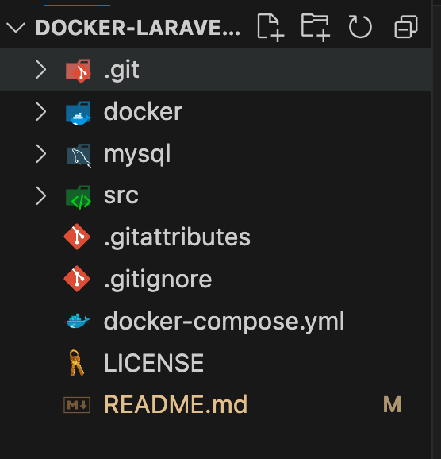
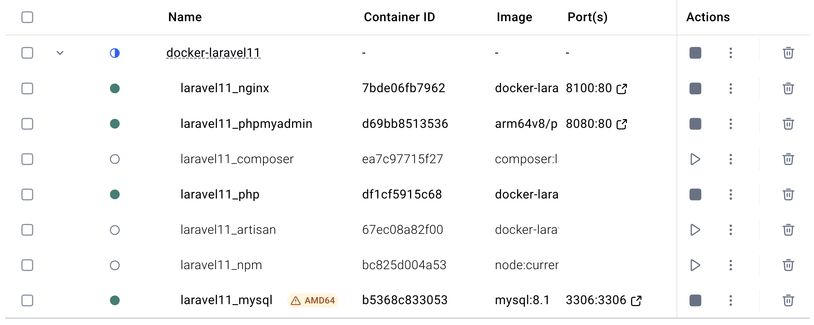

# Laravel Docker Development Environment

Laravel 11을 위한 완전한 Docker 개발 환경입니다.

## 🏗️ 프로젝트 구조




### 디렉토리 구조

- `docker/` - Docker 관련 설정 파일들
  - `nginx/` - Nginx 설정 파일들
  - `php/` - PHP 설정 파일들
- `src/` - Laravel 프로젝트 코드가 저장될 폴더
- `mysql/` - MySQL 데이터 저장소
- `docker-compose.yml` - Docker Compose 설정 파일

## 🚀 빠른 시작

### 1. 환경 설정

```bash
# 필요한 디렉토리 생성
mkdir -p ./src
mkdir -p ./mysql

# 환경 변수 파일 복사 (필수)
cp docker.env.example docker.env
```

> **중요**: 환경 변수 파일을 복사하지 않으면 기본값이 사용됩니다. 프로덕션 환경에서는 반드시 `docker.env` 파일을 생성하고 보안을 위해 기본값을 변경하세요.

### 2. Docker 컨테이너 빌드

```bash
docker compose build
```

### 3. Laravel 프로젝트 생성

```bash
docker compose run --rm composer create-project laravel/laravel .
```

### 4. 컨테이너 시작

```bash
docker compose up -d
```

### 5. Laravel 환경 설정

`src/.env` 파일에서 데이터베이스 설정을 수정하세요:

```env
DB_CONNECTION=mysql
DB_HOST=mysql
DB_PORT=3306
DB_DATABASE=laraveldb
DB_USERNAME=laravel
DB_PASSWORD=secret
```

### 6. 마이그레이션 실행

```bash
docker compose run --rm artisan migrate
```

## 🌐 접속 정보

- **Laravel 애플리케이션**: http://localhost:${NGINX_PORT:-8100}
- **phpMyAdmin**: http://localhost:${PHPMYADMIN_PORT:-8080}
  - 서버: mysql
  - 사용자명: ${MYSQL_USER:-laravel}
  - 비밀번호: ${MYSQL_PASSWORD:-secret}

> **참고**: 포트 번호는 `docker.env` 파일에서 변경할 수 있습니다.

## 🛠️ 유용한 명령어

### 컨테이너 관리
```bash
# 컨테이너 시작
docker compose up -d

# 컨테이너 중지
docker compose down

# 로그 확인
docker compose logs -f

# 특정 서비스 로그 확인
docker compose logs -f php
```

### Laravel 명령어
```bash
# Artisan 명령어 실행
docker compose run --rm artisan migrate
docker compose run --rm artisan make:controller UserController
docker compose run --rm artisan tinker

# Composer 명령어 실행
docker compose run --rm composer install
docker compose run --rm composer require package-name

# NPM 명령어 실행
docker compose run --rm npm install
docker compose run --rm npm run dev
```

### 컨테이너 접속
```bash
# PHP 컨테이너 접속
docker compose exec php sh

# MySQL 컨테이너 접속
docker compose exec mysql mysql -u laravel -p laraveldb
```

## 🔧 문제 해결

### 권한 문제
```bash
docker compose run --rm php chown -R laravel:laravel /var/www/html
```

### 캐시 클리어
```bash
docker compose run --rm artisan cache:clear
docker compose run --rm artisan config:clear
docker compose run --rm artisan route:clear
docker compose run --rm artisan view:clear
```

## 📝 주요 개선사항

1. **보안 강화**: 보안 헤더 추가, 숨겨진 파일 접근 차단
2. **성능 최적화**: Gzip 압축, 정적 파일 캐싱
3. **네트워크 격리**: Docker 네트워크 사용
4. **데이터 지속성**: MySQL 데이터 볼륨 사용
5. **자동 재시작**: 컨테이너 자동 재시작 설정

## 🔒 보안 고려사항

- 프로덕션 환경에서는 기본 비밀번호를 변경하세요
- 환경 변수 파일을 사용하여 민감한 정보를 관리하세요
- 필요한 포트만 외부에 노출하세요

## ⚙️ 환경 변수 설정

`docker.env` 파일에서 다음 설정들을 변경할 수 있습니다:

```env
# Docker Compose 프로젝트 이름
COMPOSE_PROJECT_NAME=laravel11

# MySQL 설정
MYSQL_DATABASE=laraveldb
MYSQL_USER=laravel
MYSQL_PASSWORD=secret
MYSQL_ROOT_PASSWORD=secret

# 포트 설정
NGINX_PORT=8100
MYSQL_PORT=3306
PHPMYADMIN_PORT=8080

# Node.js 버전
NODE_VERSION=current-alpine
```

> **보안 팁**: 프로덕션 환경에서는 반드시 기본 비밀번호를 강력한 비밀번호로 변경하세요.